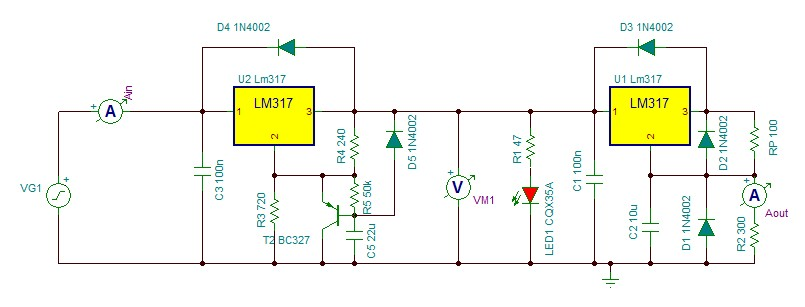

# Laser-Driver

Developing a new digital circuit using a micro-controller to drive Laser (LED1) replacing analog methods of curent control. 

<ul>
  <li>Controlling the current to a LASER thorugh digital means instead of  analog means (Variable Resistors)</li>
  <li>Reading the current drawn and power of the LASER dynamicvally using INA219 Current Sensor</li>
  <li>Interfacing an LCD to monitor the display the PWM value of micro-controller and the curreent and poweer drawn dynamically</li>
</ul>  

Additional improvent and additions

<ul>
  <li>Adding a temperature sensor to measure the ambient temperature</li>
  <li>Adding a bluetooth transreciever to control the curreent value remotely</li> 
  <li>Developing an app or webpage based GUI application</li>
  <li>Logging all the data recieved and store it on sd card or cloud</li>
  <li>Housing all the electronics in a approprite housing.</li>
</ul>  

## Protoyping the existing circuit

  

